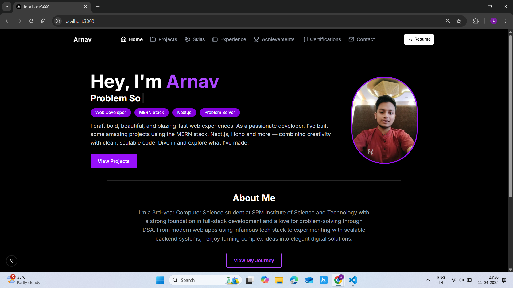

# My Personal Portfolio

Welcome to my personal portfolio website! Crafted with 💖 using **Next.js**, **Tailwind CSS**,**Shadcn UI**, and **Framer Motion**, this site is a reflection of my journey as a Full-stack Web developer and a problem solver.



---

## 🧠 About Me

Hi, I’m **Arnav**, a Computer Science undergrad from SRMIST. I’m passionate about building modern web apps, solving real-world problems, and learning cutting-edge tech. Whether it’s crafting a pixel-perfect UI or building efficient backend systems — I love doing it all!

---

## 🛠️ Tech Stack

- ⚛️ Next.js & React
- 🎨 Tailwind CSS & Shadcn UI
- 🎞️ Framer Motion  
- 💬 Custom Chatbot  
- 🧠 Typewriter Effect  
- 🌐 Deployment: Vercel / Netlify  

---

## ✨ Features

- 🔥 Smooth animated intro screen  
- 🎯 Dynamic typewriter effect for roles  
- 📱 Fully responsive layout  
- 🤖 Chatbot integration  
- 📂 Project & experience showcase  
- 🧭 Clean, scalable code  

---

## 📁 Project Structure

```
.
├── components/
│   └── ChatBot.js
├── pages/
│   ├── index.tsx (Home)
│   └── projects.tsx, experience.tsx
├── public/
│   └── home/download.jpg, Arnav Image.jpg
├── styles/
├── README.md
```

---

## 🧪 Getting Started Locally

```bash
git clone https://github.com/your-username/arnav-portfolio.git
cd arnav-portfolio
npm install
npm run dev
```

---

## 🌐 Live Demo

> [Click here to view live](https://my-live-site-url.com)

---

## 🤝 Connect with Me

- 💼 [LinkedIn](https://www.linkedin.com/in/arnav-agarwal-b6334a247/)
- 🐙 [GitHub](https://github.com/arnav-343-agarwal)
- 📧 agarwalarnav2003@gmail.com

---

Made with 💜 by **Arnav Agarwal**
